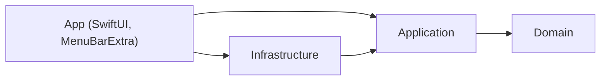

# OpenRouter Meter

App de barra de menus do macOS que mostra, o tempo todo, quanto ainda resta de crédito
na conta do OpenRouter — e, ao clicar, o consumo completo: saldo, medidor de uso, tokens,
chamadas, custo estimado e os modelos que mais pesaram hoje e nos últimos sete dias.

É a versão nativa do script `~/.hermes/scripts/openrouter-balance.sh`, que continua
existindo para o cronjob diário das 9h e das 18h.

## Como usar

```bash
make app         # gera o projeto, compila e abre o app
make verify-pr   # formatação, lint, testes e cobertura
```

Na primeira execução o app procura a chave da API nesta ordem:

1. Keychain (`dev.ronanrodrigo.OpenRouterMeter`), preenchida pelos Ajustes do app;
2. `OPENROUTER_API_KEY` em `$HERMES_HOME/.env` (padrão `~/.hermes/.env`).

Sem chave de provisioning da OpenRouter, o detalhamento de tokens e modelos vem do
histórico local do Hermes (`$HERMES_HOME/state.db`, lido somente para leitura).

## Arquitetura

Quatro camadas, com a direção de dependência imposta por módulos SwiftPM:



- `Packages/Domain` — dinheiro em micro-dólares, contagem de tokens, janelas de consumo, erros estáveis. Nenhum import de framework.
- `Packages/Application` — gateways e serviços com `execute(...)`; nenhum nome de fornecedor.
- `Packages/Infrastructure` — HTTP da OpenRouter, SQLite do Hermes, Keychain, adaptadores `Sample`.
- `OpenRouterMeter` — views, `@Observable` view model e o composition root.

Detalhes em [`docs/architecture.md`](docs/architecture.md) e nos ADRs.
