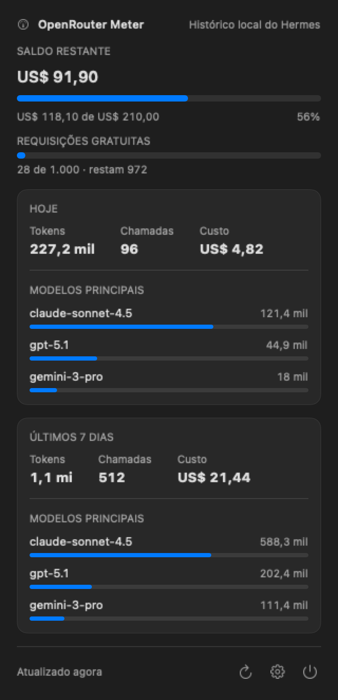
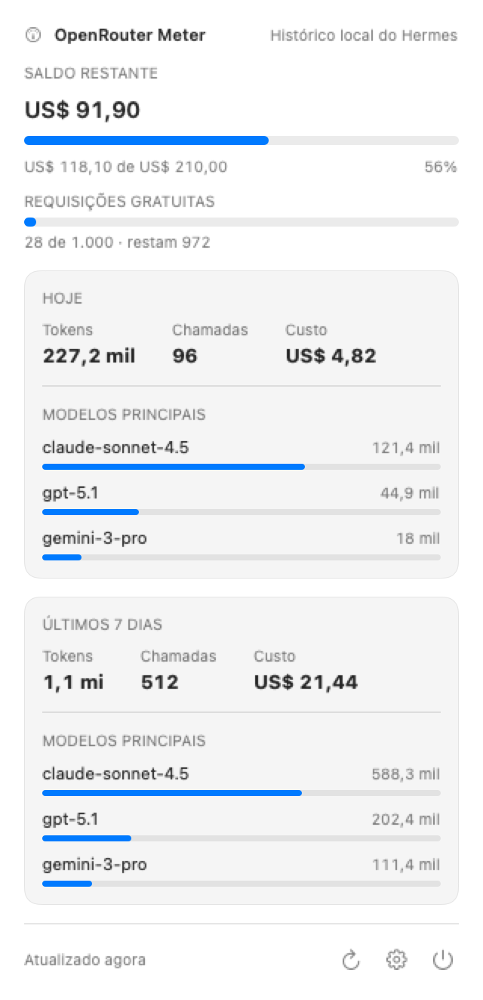
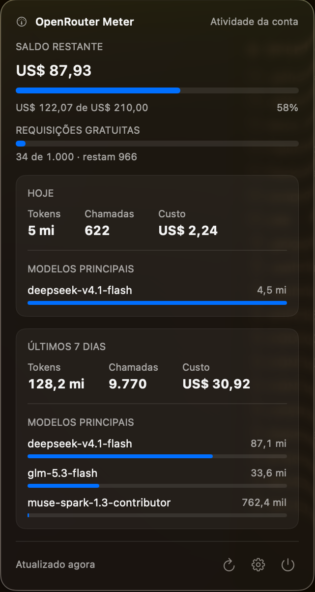
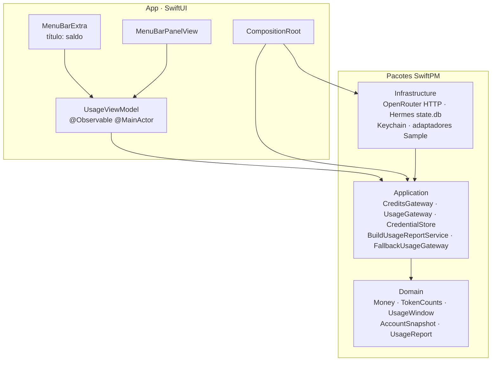

<div align="center">

# OpenRouter Meter

**Quanto ainda resta na sua conta do OpenRouter — sempre à vista na barra de menus do macOS.**

[](https://github.com/ronanrodrigo/openrouter-meter/actions/workflows/verify.yml)


[](https://github.com/ronanrodrigo/homebrew-tap)
[](LICENSE)


</div>

Sem clicar, o saldo. Com um clique, o painel completo: consumo, cota de requisições
gratuitas, tokens, chamadas, custo e os modelos que mais pesaram hoje e nos últimos sete dias.

<table>
<tr>
<td></td>
<td></td>
</tr>
<tr>
<td align="center"><sub>Modo escuro</sub></td>
<td align="center"><sub>Modo claro</sub></td>
</tr>
</table>

## O que ele mostra



**Na barra de menus**, o valor escolhido em Ajustes: o saldo restante (padrão) ou o custo de
hoje. Sem leitura ainda, a barra mostra `—`.

**No painel**:

- **Saldo restante**, com o medidor de consumo logo abaixo — crédito consumido, em
  porcentagem, e a linha `US$ 119,73 de US$ 210,00` com `57%`.
- **Requisições gratuitas**, a cota diária dos modelos gratuitos: `34 de 1.000 · restam 966`.
- **HOJE** e **ÚLTIMOS 7 DIAS** — dois cartões com **Tokens**, **Chamadas** e **Custo**, e a
  distribuição entre os **Modelos principais** (participação em tokens de entrada, barra por
  modelo).
- **Rodapé** com quando foi atualizado (`Atualizado agora`) e os botões de atualizar, ajustes
  e sair.

O cabeçalho diz de onde veio o detalhamento, e os Ajustes controlam o que aparece na barra e
a cadência de atualização: 1 minuto, 5 minutos (padrão), 15 minutos ou 1 hora. Ao abrir o
painel o relatório é relido, e o app atualiza sozinho no intervalo escolhido.

## Instalação

Requisito: **macOS 15 ou mais recente**.

### Homebrew (recomendado)

```bash
brew install --cask ronanrodrigo/tap/openrouter-meter
```

O cask mora no tap público [`ronanrodrigo/homebrew-tap`](https://github.com/ronanrodrigo/homebrew-tap)
(`Casks/openrouter-meter.rb`) e instala o `OpenRouterMeter-<VERSION>.zip` publicado nas
[releases](https://github.com/ronanrodrigo/openrouter-meter/releases): binário universal, arm64
e x86_64, compilado a partir do código-fonte pelo workflow de release a cada tag `v*`.

Se preferir os dois passos explícitos:

```bash
brew tap ronanrodrigo/tap
brew install --cask openrouter-meter
```

Atualizar e desinstalar:

```bash
brew upgrade --cask openrouter-meter           # atualiza para a última release
brew uninstall --cask openrouter-meter         # desinstala
brew uninstall --zap --cask openrouter-meter   # desinstala e remove os resíduos
```

**Sobre a assinatura:** o binário é assinado **ad-hoc** e **não é notarizado** — não há
certificado Developer ID no fluxo de release. Ao instalar, o cask remove o atributo de
quarentena da app para que ela abra normalmente. O código é aberto (MIT) e o build é
reprodutível localmente (veja abaixo), se você preferir conferir o que roda.

### A partir do código-fonte

Para compilar você mesmo, com **Xcode 26** (toolchain **Swift 6**) e as ferramentas de build
(via [Homebrew](https://brew.sh)):

```bash
brew install xcodegen swiftlint swiftformat
```

Clone e rode:

```bash
git clone https://github.com/ronanrodrigo/openrouter-meter.git
cd openrouter-meter
make app
```

`make app` gera o projeto com `xcodegen generate` (o `.xcodeproj` não é versionado e é
reconstruído a cada build), compila com `xcodebuild` e abre o aplicativo.

### A chave da OpenRouter

O app precisa de uma chave da API para ler o saldo. Duas origens, nesta ordem:

1. **Keychain do macOS**, gravado pelos Ajustes do app (ícone de engrenagem no rodapé do
   painel → **Chave da API da OpenRouter** → **Salvar**). O serviço usado é
   `dev.ronanrodrigo.OpenRouterMeter`.
2. **`OPENROUTER_API_KEY` em `$HERMES_HOME/.env`** (padrão `~/.hermes/.env`), se você já usa
   o Hermes — assim não há configuração duplicada. Esse arquivo pertence ao Hermes: o app só
   lê, nunca escreve.

Sem chave configurada em lugar nenhum, o painel mostra
`Nenhuma chave da OpenRouter configurada. Salve uma chave em Ajustes para ver o saldo.` com um
botão **Abrir Ajustes**, e a barra de menus fica em `—`. Nenhuma credencial é versionada: a
chave vive no Keychain ou em um `.env` fora do git.

## De onde vêm os números

| O que aparece no painel | Origem |
| --- | --- |
| Saldo restante, crédito contratado e consumo acumulado | `GET /api/v1/credits` da OpenRouter |
| Uso diário, semanal e mensal, plano gratuito e cota de modelos gratuitos | `GET /api/v1/key` da OpenRouter |
| Tokens, chamadas, custo e modelos de **HOJE** e **ÚLTIMOS 7 DIAS** | histórico local do Hermes: `$HERMES_HOME/state.db`, tabela `session_model_usage`, aberta somente para leitura |

O cabeçalho do painel indica qual das duas origens respondeu pelo detalhamento:
**Atividade da conta** (atividade oficial da OpenRouter) ou **Histórico local do Hermes**.

**A parte honesta:** `GET /api/v1/activity`, a atividade oficial da conta, responde **403**
para uma chave de inferência comum — ela exige uma chave de *provisioning*. Por isso, no caso
geral, o detalhamento por modelo vem do histórico local do Hermes: só entra o que passou pelo
Hermes, com o custo efetivamente cobrado (`actual_cost_usd`) e, na falta dele, a estimativa
(`estimated_cost_usd`). Com uma chave de provisioning, o app passa a usar a atividade oficial
sozinho e cai para o histórico local apenas se ela estiver indisponível — você não configura
nada além da chave.

## Arquitetura

Quatro camadas, com a direção de dependência imposta pelos `Package.swift` de cada pacote —
um import fora da direção não compila:



- **`Packages/Domain`** — valores e regras puras, sem `Foundation`: `Money` em micro-dólares
  inteiros, contagem de tokens, janelas de consumo, `AccountSnapshot`, `UsageReport` e os
  erros estáveis do produto.
- **`Packages/Application`** — gateways nomeados pela capacidade, nunca pelo fornecedor
  (`CreditsGateway`, `UsageGateway`, `CredentialStore`), o `BuildUsageReportService.execute()`
  e as duas costuras de degradação (`FallbackUsageGateway`,
  `FirstAvailableCredentialStore`).
- **`Packages/Infrastructure`** — todo o IO: HTTP da OpenRouter, leitura somente-leitura do
  `state.db` do Hermes via SQLite3, Keychain e os adaptadores `Sample` determinísticos usados
  por previews e testes. Erro de fornecedor é traduzido para `UsageError` na fronteira.
- **`OpenRouterMeter/Sources`** — views SwiftUI, view model `@Observable` `@MainActor`, design
  system, formatação e o `CompositionRoot`, único lugar que instancia adaptadores concretos.

Detalhes, fluxo de atualização e decisões em [`docs/architecture.md`](docs/architecture.md) e
nos ADRs:

- [ADR 0001 — App de barra de menus em camadas SwiftPM](docs/adr/0001-architecture.md)
- [ADR 0002 — Fontes de dados e degradação](docs/adr/0002-data-sources.md)
- [ADR 0003 — Política de cobertura](docs/adr/0003-coverage-policy.md)
- [ADR 0004 — CI no GitHub Actions](docs/adr/0004-ci-github-actions.md)

## Desenvolvimento

O gate é único: nada é declarado pronto sem `make verify-pr` verde, e é ele que o CI
([`.github/workflows/verify.yml`](.github/workflows/verify.yml), runner `macos-15`) executa a
cada push na `main` e a cada pull request.

```bash
make verify-pr   # format-check, lint, testes dos pacotes, testes do app e cobertura
make test        # só os testes
make lint        # SwiftLint --strict
make format      # SwiftFormat
make app         # compila e abre o app
make package      # empacota o app no zip universal de release
make release VERSION=x.y.z  # publica o release e atualiza o cask no tap
make clean       # remove build/, .xcodeproj e os .build dos pacotes
```

### Release

A versão vive em `MARKETING_VERSION` no [`project.yml`](project.yml), e a tag precisa bater
com ela: a versão `1.0.0` corresponde à tag `v1.0.0`. É a tag que dispara o workflow
[`.github/workflows/release.yml`](.github/workflows/release.yml), que compila o app a partir
do código-fonte e publica o `OpenRouterMeter-<VERSION>.zip` nas releases. Localmente,
`make package` gera esse zip e `make release VERSION=x.y.z` faz a publicação
([`scripts/package.sh`](scripts/package.sh) e [`scripts/release.sh`](scripts/release.sh)); o
cask do tap é sincronizado por `make sync-tap VERSION=x.y.z`
([`scripts/sync-tap.sh`](scripts/sync-tap.sh)), que lê o sha256 do asset `.sha256` do release
publicado — o build universal não é bit a bit reprodutível, então o cask nunca aponta para o
hash de um build local. O conteúdo do tap é versionado em
[`packaging/homebrew-tap/`](packaging/homebrew-tap/).

### Cobertura

Duas políticas, explícitas no gate e explicadas no
[ADR 0003](docs/adr/0003-coverage-policy.md):

| Medida | Mínimo | Última execução local |
| --- | --- | --- |
| `Domain` | 80% de linhas | 99,17% |
| `Application` | 80% de linhas | 100% |
| `Infrastructure` | 80% de linhas | 95,78% |
| Alvo de app agregado (`xccov` sobre o `.xcresult`) | 70% de linhas | 87,30% |

Os números dos pacotes vêm de `llvm-cov` sobre o binário de teste de cada pacote, contando só
os fontes do próprio pacote. O alvo de app é medido pelo `xccov` sobre o `.xcresult` — que
agrega o alvo e as camadas instrumentadas dentro do bundle; isolado, o alvo
`OpenRouterMeter.app` mede 96,70%. O mínimo de 70% existe desde
que o harness `OpenRouterMeter/Tests/ViewRenderingTests.swift` passou a desenhar cada view de
verdade com `ImageRenderer`, em claro e em escuro, exigindo dimensão esperada, PNG gravado e
render com mais de uma cor. Testes hoje: 20 em `Domain`, 12 em `Application`, 33 em
`Infrastructure` e 40 no alvo de app. Mudança de política exige ADR novo; nunca rebaixe os
mínimos para uma mudança passar.

### Fronteiras de camada no lint

O `.swiftlint.yml` é especificação executável de arquitetura, não estética. As fronteiras
ficam em configurações aninhadas por camada (o SwiftLint aplica o `.swiftlint.yml` do
diretório mais próximo), e há regra custom que barra credencial literal no fonte. O lint é
reforço da direção de dependência — o mecanismo primário é o `Package.swift`.

### Hook de credencial

O repositório traz um hook de `pre-commit` que bloqueia qualquer commit que introduza
credencial, olhando apenas o que está preparado (`git diff --cached`):

```bash
git config core.hooksPath .githooks   # ativa neste clone
bash scripts/check-credential-hook.sh # prova os três casos do hook
```

Um falso positivo consciente pode ser liberado com `ALLOW_SECRET_COMMIT=1 git commit ...`.

## Limitações

- **Só macOS 15 ou mais recente**. A distribuição é pelo cask de um tap pessoal
  (`ronanrodrigo/homebrew-tap`), e o binário é assinado ad-hoc, sem notarização: em vez de um
  certificado Developer ID, o cask remove a quarentena da app instalada para que ela abra.
- **O detalhamento de tokens e modelos depende do Hermes** enquanto não houver chave de
  provisioning. Consumo de outras ferramentas com a mesma conta não aparece nos cartões.
- **Custo por janela é o que o histórico registra**: o valor cobrado quando existe
  (`actual_cost_usd`); na falta dele, a estimativa (`estimated_cost_usd`).
- **Sem chave, não há saldo**: a barra de menus fica em `—` e o painel só mostra o aviso de
  configuração.
- **Interface e documentação em pt-BR**; o código e os nomes de arquivo, em inglês.

## Licença e créditos

[MIT](LICENSE) — Copyright (c) 2026 Ronan Rodrigo Nunes.

Este app é a versão nativa do script `~/.hermes/scripts/openrouter-balance.sh`, que continua
existindo para o cronjob diário. Não é afiliado à OpenRouter; os dados vêm da
[API pública da OpenRouter](https://openrouter.ai/docs) e do histórico local do
[Hermes](https://hermes-agent.nousresearch.com/docs).

Contribuições são bem-vindas — comece por [`CONTRIBUTING.md`](CONTRIBUTING.md). Para relatar
uma vulnerabilidade, veja [`SECURITY.md`](SECURITY.md); o projeto segue o
[`CODE_OF_CONDUCT.md`](CODE_OF_CONDUCT.md).

<div align="center">

<sub><a href="https://github.com/ronanrodrigo/openrouter-meter">github.com/ronanrodrigo/openrouter-meter</a> · <a href="https://openrouter-meter.vercel.app">openrouter-meter.vercel.app</a></sub>

</div>
