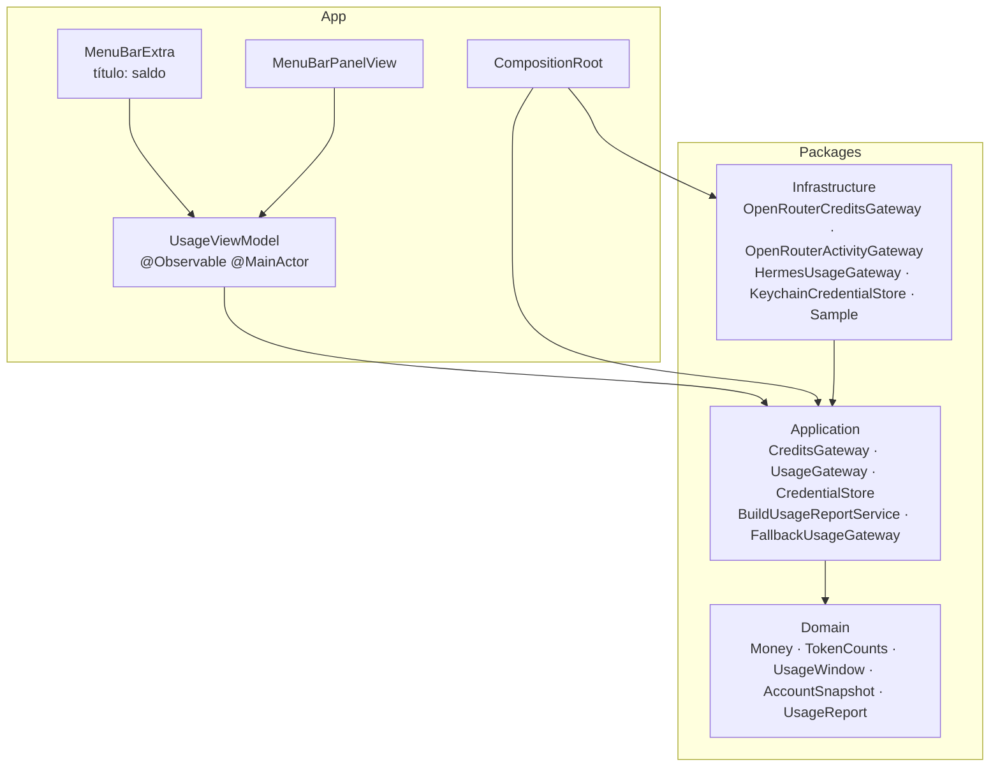
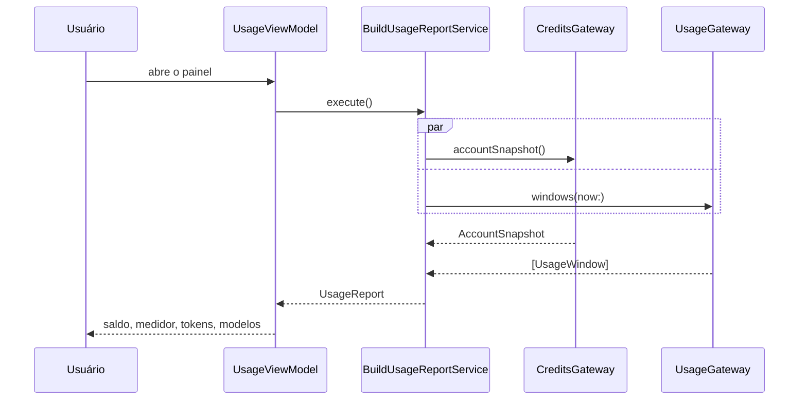

# Arquitetura

## Objetivo

Um app de barra de menus que responde a uma pergunta em duas camadas de profundidade:
*sem clicar* — quanto resta de crédito; *clicando* — quanto, em quê e com quais modelos
esse crédito está sendo gasto.

## Camadas

A direção é imposta por SwiftPM: cada camada é um pacote com `Package.swift` próprio, e um
import fora da direção simplesmente não compila. O SwiftLint reforça a mesma fronteira com
mensagem explícita — o lint é reforço, nunca o mecanismo primário.

### Domain

Valores puros e sem `Foundation`: `Money` em micro-dólares inteiros (evita erro de ponto
flutuante em somas), `TokenCounts`, `ModelUsage`, `UsageWindow`, `AccountSnapshot`,
`UnixTimestamp` e `UsageError`. Regras que o produto depende vivem aqui e não podem ser
contornadas: saldo é sempre crédito menos consumo; participação de um modelo é medida em
tokens de entrada; fração consumida fica entre 0 e 1.

### Application

Uma capacidade por arquivo, nomeada pela capacidade e nunca pelo fornecedor:
`CreditsGateway`, `UsageGateway`, `CredentialStore`. `BuildUsageReportService.execute()`
monta o relatório: busca crédito e consumo em paralelo e trata o saldo como obrigatório —
se ele falha, o relatório falha; se apenas o detalhamento falha, o relatório sai menor em
vez de vazio. `FallbackUsageGateway` e `FirstAvailableCredentialStore` expressam as duas
costuras de degradação sem que a camada interna saiba qual fornecedor respondeu.

### Infrastructure

Isola todo o IO e traduz erro de fornecedor para `UsageError` na fronteira: nenhum erro de
`URLSession`, `SQLite3` ou `Security` escapa para a aplicação.

- `OpenRouterCreditsGateway` — `GET /credits` combinado com `GET /key` num único `AccountSnapshot`.
- `OpenRouterActivityGateway` — atividade oficial por data; exige chave de provisioning e devolve `unavailable` quando ela não existe.
- `HermesUsageGateway` — abre `state.db` somente para leitura e agrega por modelo nas janelas de hoje e de sete dias.
- `KeychainCredentialStore` e `HermesEnvironmentCredentialStore` — a chave digitada pelo usuário e a chave já existente no ambiente do Hermes.
- `Sample/` — adaptadores determinísticos em memória, sem SDK, sem `URLSession` e sem `FileManager`, usados por previews e testes.

### App

`MenuBarExtra` com estilo de janela, um `UsageViewModel` `@MainActor @Observable` com uma
única ideia de estado, e views que apenas descrevem hierarquia visual. Todo número é
formatado no lado da apresentação, com o locale do usuário. O `CompositionRoot` é o único
lugar que instancia adaptadores concretos.

## Fluxo de atualização

O mesmo `execute()` roda em intervalo configurável (padrão 300s) e a cada abertura do painel.

## Distribuição

O app é distribuído por Homebrew cask, no tap público `ronanrodrigo/homebrew-tap`
(`brew install --cask ronanrodrigo/tap/openrouter-meter`), com release automatizado por tag.
Compilar do código-fonte continua sendo o caminho de desenvolvedor. A decisão, a assinatura
ad-hoc sem notarização e o tratamento de quarentena estão no ADR 0005.

## Decisões registradas

- [ADR 0001 — App de barra de menus em camadas SwiftPM](adr/0001-architecture.md)
- [ADR 0002 — Fontes de dados e degradação](adr/0002-data-sources.md)
- [ADR 0003 — Duas políticas de cobertura](adr/0003-coverage-policy.md)
- [ADR 0004 — CI no GitHub Actions](adr/0004-ci-github-actions.md)
- [ADR 0005 — Distribuição por Homebrew cask](adr/0005-distribuicao-homebrew-cask.md)
